# statistical machine learning models for generating hand written digits using the MNIST dataset [[1]](https://github.com/mohamad-m2/mnist_testing/edit/main/README.md#references)

first we start with studying the effect of the dimentionality reduction techniques PCA and LDA those will help gaussianize the mnist data samples for the generation later.
for the generation we estimate the gaussion distribution of each class, then sample from that distribution.

## PCA 50 feature vectors
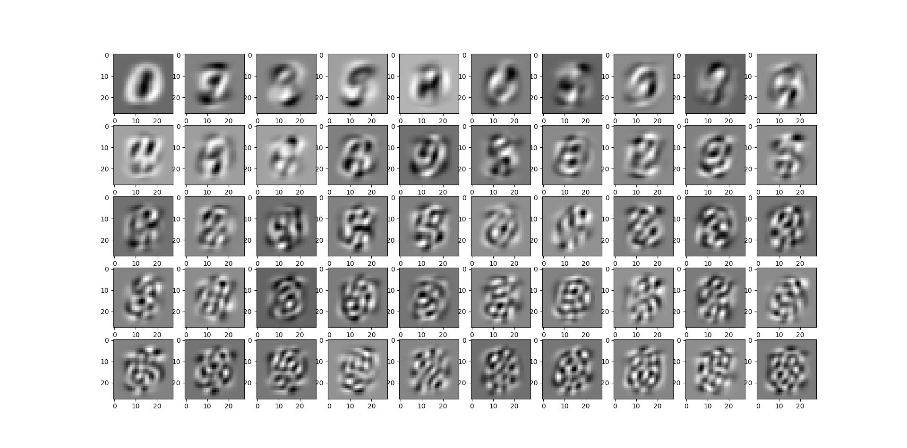

## LDA 10 feature vectors

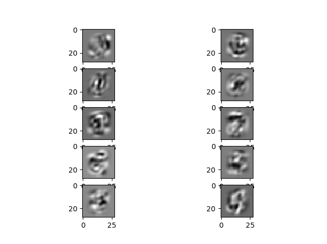

---

we can also study the quality of the reconstructed sample from both LDA and PCA.
PCA focus on the dimensions with highest variances, the reconstruction error is minimal and the reconstructed image is similar to the initial one.
while for LDA which focuses on minimizing intra class variance and maximimze the inter class one (supervised) the reconstruction error is high.

## some reconstructed samples after PCA 

  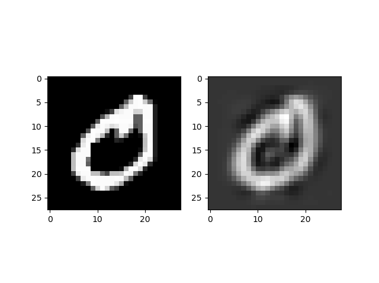
  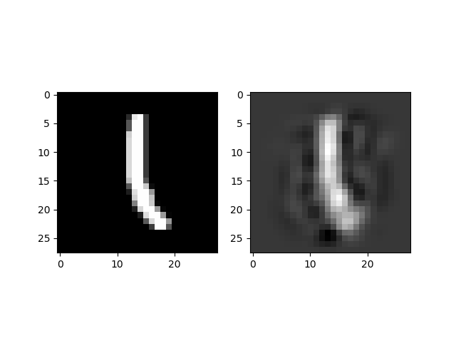
  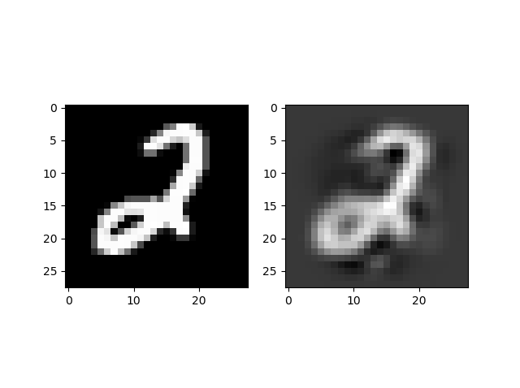
  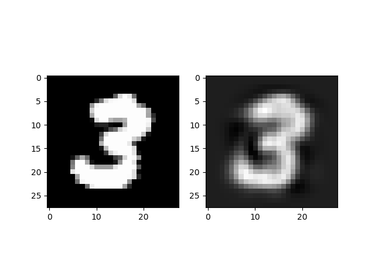

## some reconstructed samples after LDA 

  
  
  
  

---
## generation
for checking how different the images we generate from all the other images with the same class in the dataset we can implement a simple distance function and take the minimum distance between our geerated image and all the other images presented in the data
this can work for mnist dataset since the only value the pixel can have are either 0 for black and 1 for white.
finally for a better generation we could also consider the gaussian mixture model for estimating the distribution of the classes instead of 1 simple gaussian distribution. 

  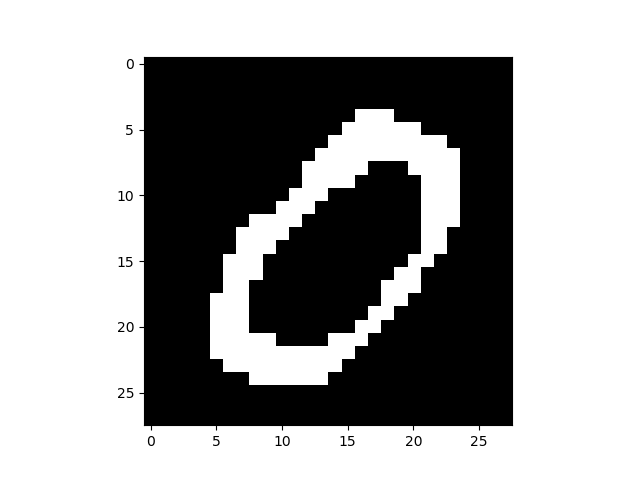
  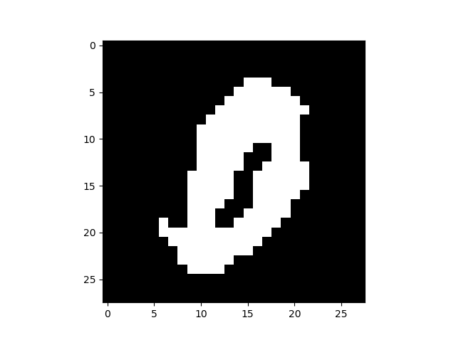
  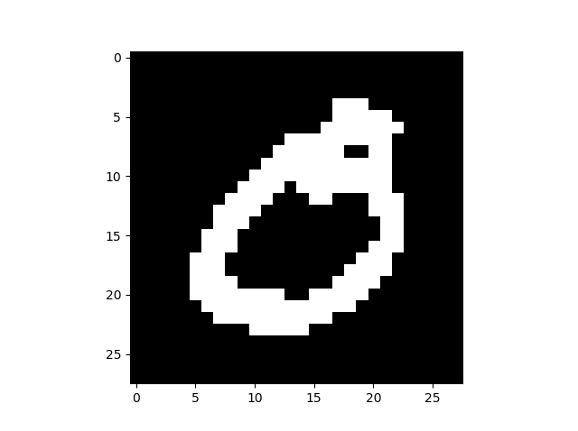
  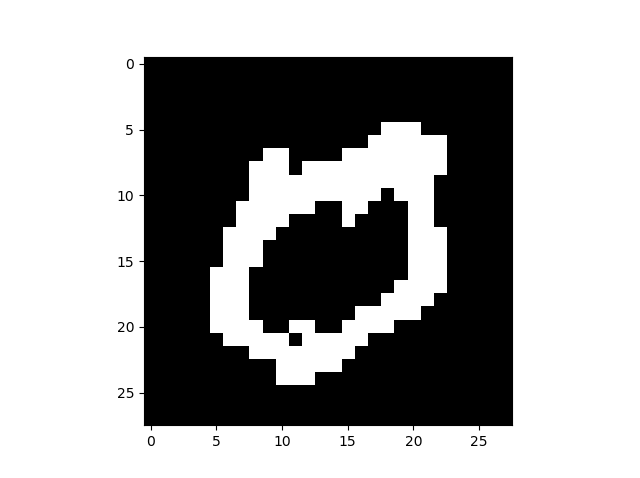
  
  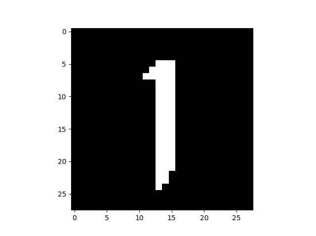
  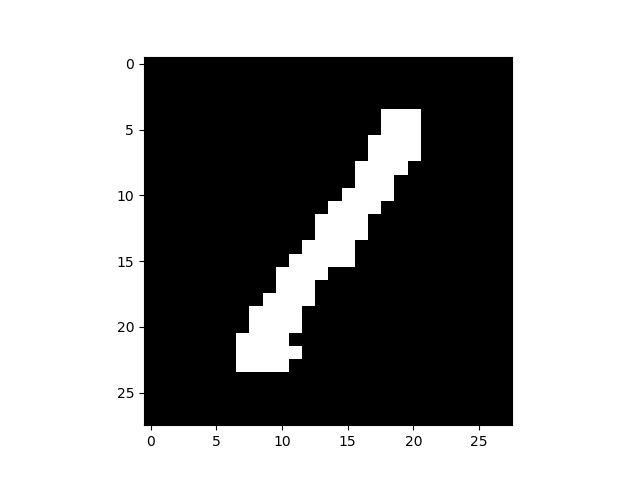
  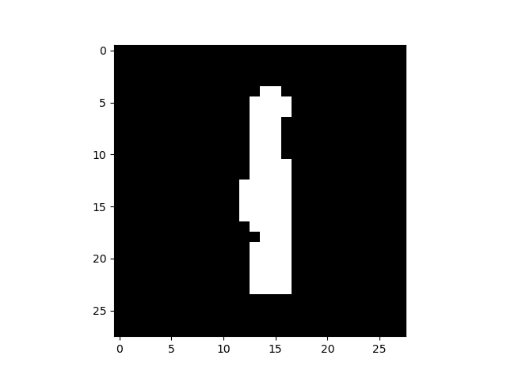
  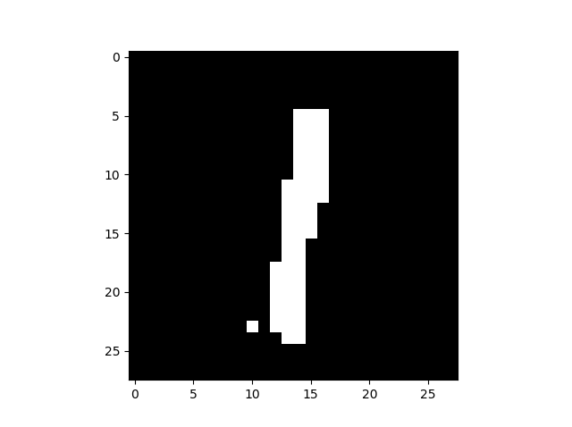
  
  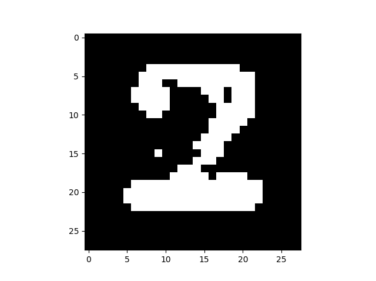
  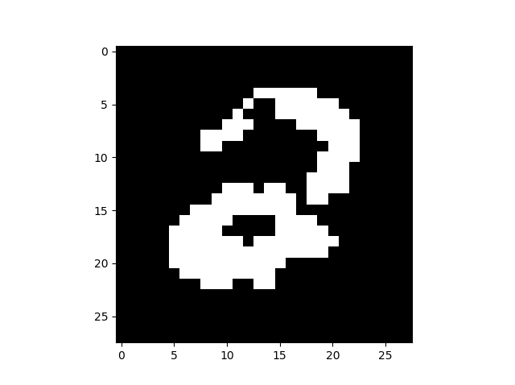
  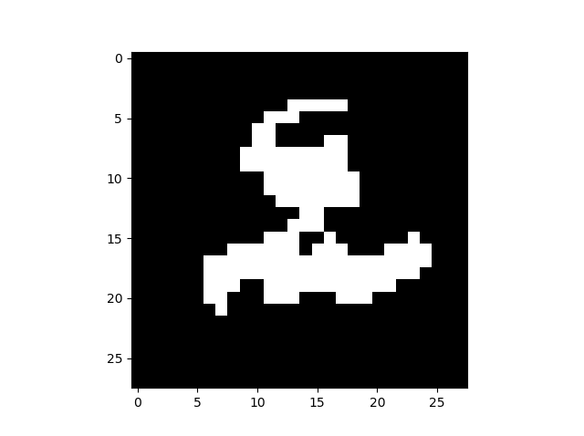
  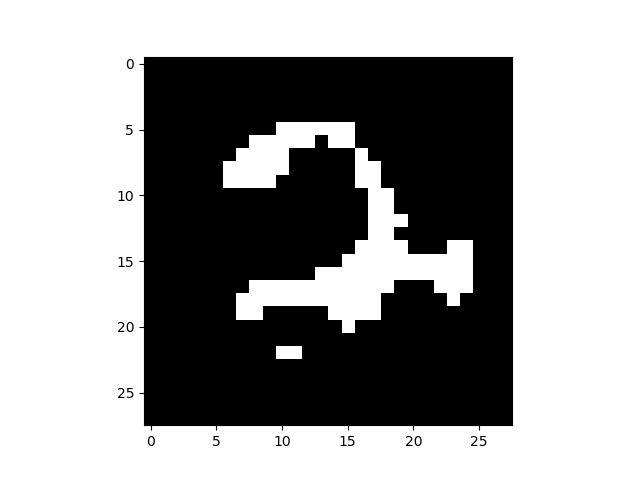
  
  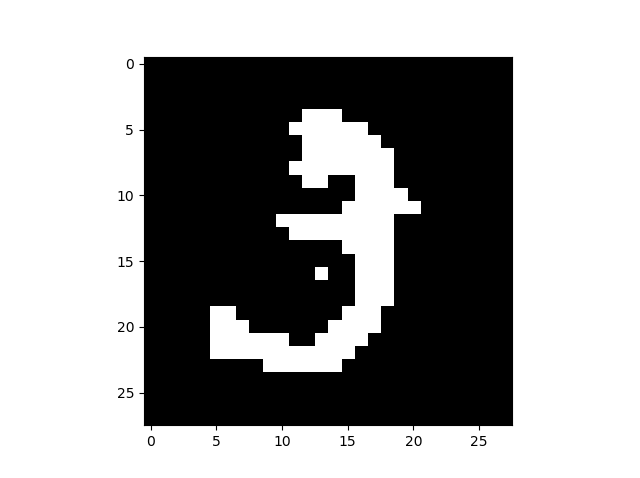
  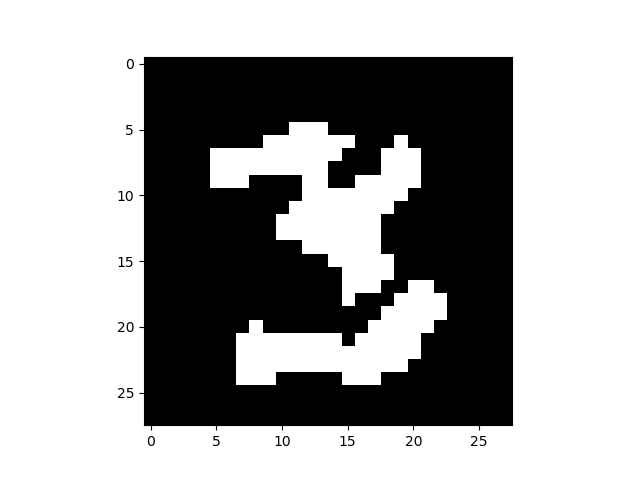
  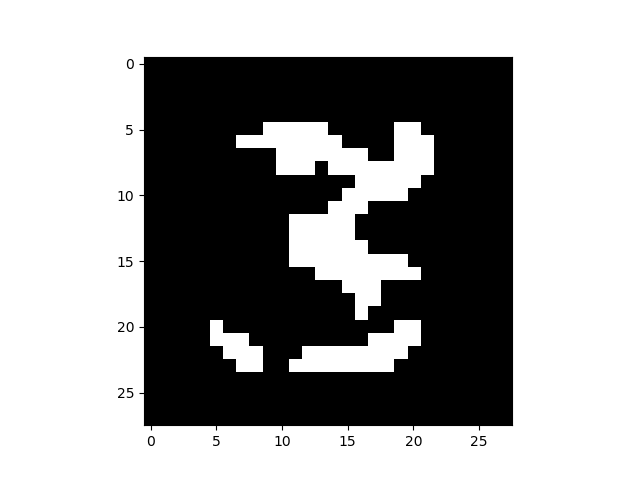
  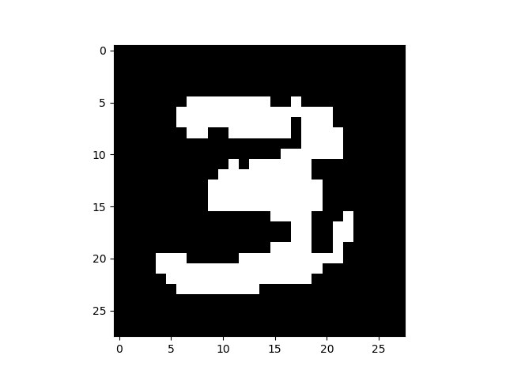

## References
<a id="1">[1]</a> 
Y. LeCun, and C. Cortes. (2010). 
MNIST handwritten digit database
http://yann.lecun.com/exdb/mnist/
